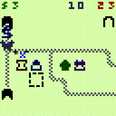
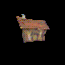
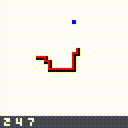
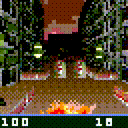
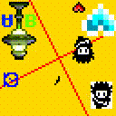
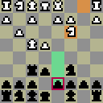
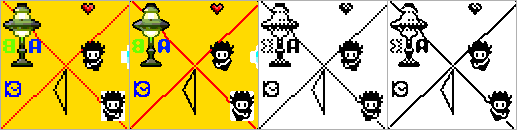

# Small Abstract Fish (SAF)

[original SAF files HERE from drummyfish](https://codeberg.org/drummyfish/SAF)


 *tiny public domain suckless portable console for small games*

     

If you create a game with SAF, I'll be glad if you let me know!

in browser games: [MicroTD](http://www.tastyfish.cz/saf/utd.html), [Minigames](http://www.tastyfish.cz/saf/minigames.html)

## Philosophy

SAF wants to provide you with a distilled joy of simple nostalgic game
programming with as little friction and frustration as possible (no complicated
APIs, no bloat, no legal conditions, ...), while also supporting creation of
ethical games that can run even on very simple devices, games that people can
easily study, share and improve without frustration or fear, games that will
survive forever, games that are here for you and not any corporation's profit.
SAF follows and promotes the philosophy of peace, social anarchy, free software
and mainly of "less is more", which is related to technology minimalism,
suckless, Unix and KISS philosophies. SAF is taking a step back to the times at
which technology was still sane, so that we can step forward in a new, better
direction.

## What and why?

SAF is a very minimal C interface for programming mainly small games that will
run on many small gaming consoles, but SAF will also run on PCs and other "big"
platforms, and can be used to create not just games but also other "toy"
programs. You can look at SAF in different ways:

- It's a bit like SDL for tiny computers, mainly open consoles such as Pokitto
  and Arduboy, it provides abstraction, portability and convenience functions.
  It spares people of constantly having to manually port games over and over to
  new consoles.
- It's a bit like a fantasy console, it intentionally limits you so that the
  programming is simple, comfy, and your games will inevitably be nostalgic and
  "retro". Thanks to this, SAF can be supported even on very small 8 bit
  consoles.
- It's a library that will save you from implementing and debugging many things
  over and over. And it will make it much easier to program games for platforms
  that don't come with emulators.
- It is an API, an interface, a standard, which has many advantages, it is e.g.
  easy to switch backends, automatically process the code etc.
- It behaves a bit like an emulator, it gives you the possibility to record
  inputs, speed up or slow down time, use pixel art upscaling etc.

**How exactly does this work?** SAF is wholly implemented in a single C header
file: saf.h. In it the library functions (such as shape drawing) are
implemented, as well as all supported backends (i.e. platform specific code
such as writing pixels to the screen). Which backend implementation is used
is chosen with a define before including saf.h, the code for other than the 
chosen backend will then be ignored. The game code along with saf.h then
together form source code that can be compiled for the chosen platform, just
as any other program for that platform.

**Why such low specs?** You may ask why SAF doesn't support a higher resolution,
color depth, more advanced sound effects, networking and similar features. This
is on purpose: sometimes less is more, and the decision for lower specs comes
with many advantages and benefits. For example, the joy of programming
increases as you, the programmer, can deal with less complexity, fewer
headaches from complex APIs and libraries, smaller friction, you finish your
projects faster (and, in fact, *actually* finish them), you can create assets
super quickly, see the results very early. You don't deal with resizeable
windows, mouse cursor, opening sockets and similar things, you just write the
game with focus on its pure essence, a fun gameplay. We currently have an
abundance of big, feature-heavy engines and frameworks, but very few small,
minimalist and lightweight ones, which is why I created SAF. Another reason is
portability -- since SAF aims to run on many simple platforms, its set of
features must be the lowest common denominator of these platforms (basically
every console has at least the 64x64 etc.).

**When to use this?** If you want to create a pretty simple platform independent
game and don't mind giving up the full control and performance of the specific
HW.

**But can SAF power something more advanced than "tetris"?** Yes, technically
you are only limited by the few hardcoded parameters of SAF, i.e. the hardcoded
number of buttons, display resolution etc. Computing power is not limited, so
you can in theory create a ray traced 3D game with advanced physics simulation
in SAF, and nothing is stopping you from using big 3rd party libraries, even
if that's not recommended. In this case the small consoles with simple HW will
probably not be able to run your game, which a little bit kills the purspose of
SAF, but nothing is stopping you from going wild and hacking this in ways that
go against recommendations, if that is what you want.

**Why choose this over a framework like Godot?** A game written in a "big"
engine will always be burdened by many dependencies and bloat which makes it
too much dependent on the engine and unable to run on very simple HW, even if
the game is extremely simple and could otherwise run on it, the heavyweight
engine underneath will discriminate against many platforms, and will kind of
hold you project "hostage", you need to believe a third party will for a long
time continue to develop and maintain a very expensive engine for you. This way
your game may have a minimalistic look, but it will never be beautiful and
efficient on the inside, you will always drag along a huge burden. With SAF you
can create a game that's not only art from the player's point of view, but also
from the engineer's, you keep all the advantages of having simple internals:
speed, portability, low HW demands, independence, hackability, simplicity of
compilation and so on, and you can also actually understand and change anything
in the code of SAF itself.

**When NOT to use this?** If you're creating something that needs all the power
and capabilities of a specific HW, when pushing the console towards its limits
or needing some of the specs of "big" computers, such as high resolution and HQ
sound. Choosing to program with the platform's specific library instead of SAF
is similar to choosing to program in assembly instead of a higher level
language: you get the full control and power for the price of portability,
comfortable programming, safety and other things.

**So is this a fantasy console?** Kinda yes but also not strictly. The goal of
SAF primarily isn't to create an imaginary HW platform but more to unify,
simplify, standardize and help porting, to free games of specific HW
dependencies, to find a common denominator platform. That actually goes along
well with the idea of a fantasy console, and SAF in fact does intentionaly
artificially limit some parameters such as resolution or number of buttons, just
like fantasy consoles do, however it doesn't limit the HW power (memory, CPU
frequency etc.) and it doesn't strictly enforce things like exclusion of 3rd
party libraries, it doesn't create any sandboxes or virtual environments, the
goal is to produce lightweight programs that run natively.

**Can I ignore your philosophy and just "steal" this for my proprietary
commercial project?** Yes, you can, I've willingly given up the option to
enforce any "rights" over this, and I wouldn't do it even if I could, I strongly
reject the idea of intellectual property. If you profit from this, that's great,
if you send me something back I'll be glad, if you credit me I'll be glad, but
if you don't I don't care, it's purely your business, do what you think is
right.

## Features, Advantages, Limitations

- 64 x 64 display with 256 colors (332 palette) and framebuffer (double
  buffering).
- 25 FPS.
- 7 buttons (arrows, A, B, C).
- Simple 4x4 ASCII bitmap font.
- Very simple interface and library with essential functions (e.g. LUT sin/cos
  etc.).
- SAF is written in pure C99, depends on no libraries (not even stdlib), mostly
  works with only 8 bit integer values, so it is extremely friendly to porting
  to any platform.
- 32 bytes of persistent storage (for save/load).
- 4 sounds to play.
- Main loop running at correct FPS is taken care of by SAF as well as other
  things like CLI parameter parsing, volume control, game controller support
  etc. With some frontends you get other features for free, e.g. time
  manipulation, pixel-art upscaling, input recording (allowing tool-assisted
  speedruns) etc.
- Well behaved games are deterministic. With these demo recording can be used
  for saving and loading states.
- Supported platforms (frontends):
  - SDL2 (two versions: feature-rich and minimal)
  - CSFML (SFML binding for C)
  - Emscripten (web browser JavaScript)
  - X11
  - ncurses (terminal)
  - Pokitto
  - Arduboy
  - Gamebuino META
  - ESPBoy
  - Circuitmess Nibble
  - Circuitmess Ringo
  - unofficial experiment: [TI80 calculator](https://sr.ht/~themisch/SAF-TI89/) by themisch

SAF does **not** guarantee portability to all of its supported platforms as
the program resource usage (memory, CPU, ...) isn't limited and the use of
non-portable libraries isn't enforced. SAF is a tool that will help you achieve
very high portability (along with other advantages) if you use it correctly.

SAF game running on many hardware platforms:


Example of auto-converting a game from color to monochrome and applying pixel art upscaling:



## Tutorial

This explains the basics of creating a SAF game (or another program). It shows
the typical and recommended process, however SAF doesn't enforce anything so it
is up to you whether and to what degree you follow it.

For programming in SAF you need to be familiar with basic C programming. SAF
games are written in C (following a C99 or C89 standard is recommended for
maximum portability). Even though C++ can also be used, it is not recommended
because it's not as portable as C, its bloated nature goes against the
philosophy of SAF and for simple programs its extra features are completely
unnecessary anyway.

Let's now write a simple "hello" program in SAF:

Firstly we create a source file for the program, let's name it `hello.c`. In it
we write the source:

```
#define SAF_PROGRAM_NAME "hello"
#define SAF_PLATFORM_SDL2

#include "saf.h"

void SAF_init(void)
{
}

uint8_t SAF_loop()
{
  SAF_clearScreen(SAF_COLOR_WHITE);

  SAF_drawText(4,15,"HELLO!",
    SAF_frame() & 0x04 ? SAF_COLOR_RED : SAF_COLOR_BLACK,2);

  return 1;
}
```

At the beginning we define some things for the SAF: `SAF_PROGRAM_NAME` tells SAF
the name of our program (to e.g. show in the window title), `SAF_PLATFORM_SDL2` 
tells it which frontend implementation to use, in this case SDL2 (you can try
different ones). These values must be defined **before** including `saf.h`!
There are also other optional settings you can set like this (they are
documented in the `saf.h` file itself).

Next we are required to implement two functions (this is similar to how Arduino
works): `SAF_init` in which we initialize our program (in our case we don't need
any initialization so the function is left empty) and `SAF_loop`, a function
that will be called by SAF once every game frame -- this is like the "main" body
of our program. SAF automatically handles calling the loop function at the right
FPS, so you don't have to deal with this.

Note that we do **not** write the `main` function like in "normal" C program,
that is implemented inside the SAF library. Of course, you can define any
additional functions for your program besides these required two.

It is recommended you don't include anything else than `saf.h`, not even
standard libraries such as `stdio.h` (there is one exception to which I will
get). Including libraries dereases portability and introduces complexity,
linking etc. If only a little possible, try to just use the functions that SAF
offers. All of these functions are documented in the `saf.h` file itself. Now
there is an exception: including simple "header only" libraries that aren't
compiled separately and can be distributed along in source form are okay, so
you can use these (just beware of their dependencies).

Inside the loop function we just clear screen and write out some text using the
functions that SAF provides. You can find all of these functions documented in
the `saf.h` file itself.

Now we have our program complete. The two files `hello.c` and `saf.h` together
form a source code that can be compiled, and you compile it the same way as you
would any other SDL program (since we're using the SDL frontend). For example on
GNU/Linux you may compile this program with `gcc -o hello hello.c -lSDL2`, then
run it with `./hello`. If you're using another system, compiler or frontend,
just look up how to compile such program (brief details about compilation are
mentioned under each platform section in `saf.h`).

Congratulations, you should now have completed your first SAF program!

There is one more pro tip for you: it may be more comfortable to write the game
in a header file (.h), e.g. `game.h` instead of `game.c`, and without defining
any `SAF_PLATFORM_...` in it: this will be a frontend neutral source file of
your game. Then you can create files such as `main_sdl.c` in which you simply
define `SAF_PLATFORM_SDL2` and then include `game.h`, and you will be compiling
this C file to get the SDL frontend. For another platform, let's say Arduboy,
you will create a similar file `main_arduboy.ino` in which you similarly define
`SAF_PLATFORM_ARDUBOY` and include `game.h`. And so on for each platform. But
the organization of source code is ultimately up to you.

### Advice

SAF doesn't enforce its recommendations, it relies on you not programming badly.
This is a feature, not a bug. The following advice will help you make your
programs portable, deterministic and with accordance to the spirit of SAF. Of
course, it is only up to you whether you follow it or not. Hacking is a a valid
option too.

- **Program in C** (C99 or C89), not C++. Even if you think C++ is a good
  language, which it isn't, this library is for simple things and for these
  simpler is definitely better. It is best if you write in **C99 subset of C++**
  (i.e. don't use C++ keywords as identifiers etc.) so that your code is C but
  can still be compiled as C++ as well (many platforms are based on C++).
- **Don't use libraries** (not even the standard library) unless absolutely
  necessary, and if you do, it should follow the same rules as your program,
  including this one (i.e. the library should be a single header one, and
  shouldn't not use other libraries). Try to limit yourself to only including
  "saf.h".
- **Write your game in a single file** if possible, it's just simpler and better
  to deal with one file. Having many source files may have some justification in
  huge projects and in projects composed of multiple compilation units, it makes
  sense to separate a general library from a game, but for a simple game there's
  no real reason to split the source even if it's 50k lines of code long, you
  can still open and edit the single file in multiple windows just like you
  would open multiple files. Just think about it, there's no reason for 
  fragmenting your source.
- **Don't use what you don't need** and keep it simple, e.g. if you don't need
  to use **floating point** (you don't), don't use it and rather stick to
  integers. If your game can work without the C button, don't use it (because
  e.g. Arduboy doesn't have it). If your game doesn't use sound, disable the
  functionality via the library macro. This is all for the sake of portability
  and indiscrimination. Program for the weakest platform (i.e. try to use 8 bit
  numbers, use as little RAM as possible etc.).
- **Don't use platform-specific functionality**. E.g. the Arduino's `millis()`
  or `PROGMEM`. If you really really need to use it, use macros (`#ifdef`s) to
  only allow these on the specific platform.
- **Make your creation free as in freedom**, preferably public domain under
  CC0, as is this project. Clearly state your license, it is best to be as clear
  as possible that you're applying a specific license to specific files you have
  created. By this you support sharing, hacking, improvement, education and
  other important things as others won't be afraid to reuse your game if they're
  clearly protected by your license. With public domain you're keeping the
  spirit of this library (but note that a simple "public domain" is not legally
  safe, use CC0). Of course, this decision is not and cannot be enforced, it is
  only up to you.
- **Optimize for the weakest platform you want to support**. I.e. if you want
  your program to run on 8bits with tiny RAM, prefer 8bit data types and save as
  much RAM as possible, even if this means the program won't be optimal on
  faster platforms. The fast platform will be able to handle the cost, the
  slower one might not.
- **Watch out for undefined behavior** and platform-defined behavior (such as
  bit shifts by more than the data type width etc.). This is an advice that
  applies basically to any C programming in general, but it is especially
  important for SAF as we're aiming for high portability. Tools like cppcheck
  and valgrind can help you spot these errors.
- **Keep it simple also legally**. Prefer creating your own assets before using
  third party ones, it is very simple to create tiny pixel art and you won't
  have to deal with someone else's license, correct attributions etc.

## Usage Rights

Everything in this repository is released under CC0 1.0 (public domain,
https://creativecommons.org/publicdomain/zero/1.0/) + a waiver of all other IP
rights (including patents and trademarks). 

I've written the code and created all the assets completely myself,
from scratch.

This project is made out of love and to be truly helpful to everyone, not for
any self interest. I want it to forever stay completely in the public domain,
not owned by anyone.

This is not mandatory but please consider supporting free software and free
culture by using free licenses and/or waivers.

If you'd like to support me or just read something about me and my projects,
visit my site: [www.tastyfish.cz](http://www.tastyfish.cz/).

The additional waiver of all IP rights follows:

The intent of this waiver is to ensure that this work will never be encumbered
by any exclusive intellectual property rights and will always be in the public
domain world-wide, i.e. not putting any restrictions on its use.

Each contributor to this work agrees that they waive any exclusive rights,
including but not limited to copyright, patents, trademark, trade dress,
industrial design, plant varieties and trade secrets, to any and all ideas,
concepts, processes, discoveries, improvements and inventions conceived,
discovered, made, designed, researched or developed by the contributor either
solely or jointly with others, which relate to this work or result from this
work. Should any waiver of such right be judged legally invalid or ineffective
under applicable law, the contributor hereby grants to each affected person a
royalty-free, non transferable, non sublicensable, non exclusive, irrevocable
and unconditional license to this right.
